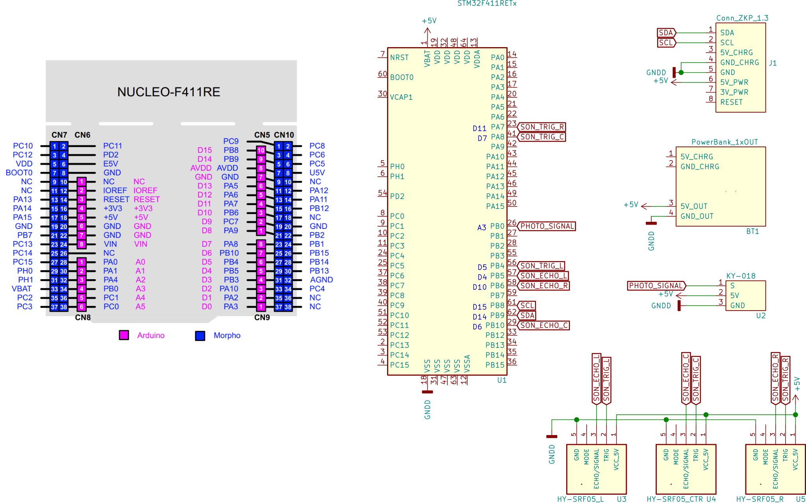

# Zakhar Sensor Platform

TBD: Outdated! Will be updated during https://github.com/Zakhar-the-Robot/io_sensors/issues/10

Sensors implementation for the Zakhar Project

Part of the [Zakhar: A robotics UX project](https://github.com/an-dr/zakhar)

Sensors list:

- KY-018 photoresistor module
- HC-SR04 module

## Schematic

## Interfaces

The I2C interface is implemented according the [ZakharI2C standard](https://github.com/an-dr/zakhar/blob/master/docs/i2c.md)

## Copyrights

Copyright (c) 2020 Andrei Gramakov. All rights reserved.
